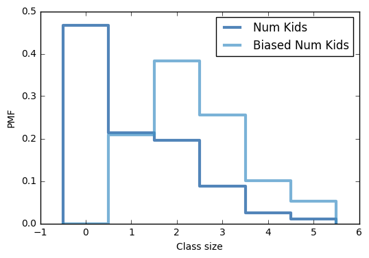

[Think Stats Chapter 3 Exercise 1](http://greenteapress.com/thinkstats2/html/thinkstats2004.html#toc31) (actual vs. biased)

>> The mean of the actual distribution is 1.02 children under 18 in the household, but a biased distribution returns 2.40 children.




Code used in chap03ex.ipynb to get mean values and distribution:


```
biased_pmf = pmf.Copy(label='Biased Num Kids')

for x, p in pmf.Items():
    biased_pmf.Mult(x, x)
        
biased_pmf.Normalize()

thinkplot.PrePlot(2)
thinkplot.Pmfs([pmf, biased_pmf])
thinkplot.Config(xlabel='Class size', ylabel='PMF')

print('Actual mean', pmf.Mean())
print('Biased mean', biased_pmf.Mean())
```
