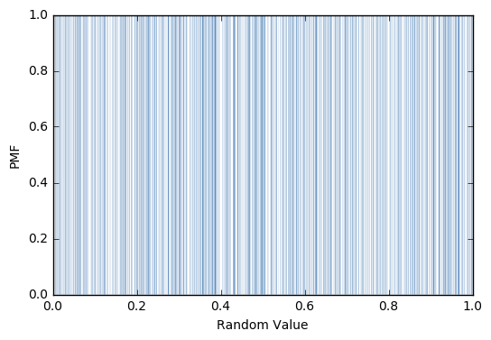

[Think Stats Chapter 4 Exercise 2](http://greenteapress.com/thinkstats2/html/thinkstats2005.html#toc41) (a random distribution)

>> The PDF distribution of the random values is not uniform because the histogram function is only binning values that are exactly the same.  Instead, it is random noise as the PDF goes from zero-one-zero at each interval where there is a number.  If it binned with a discrete width, the distribution would be more uniform.  Looking at the CDF, since it is close to linear with slope 1 and y-intercept of 0, the distribution is uniform.

Code used in chap04ex.ipynb used to get images:

```
x = thinkstats2.Hist(np.random.random(1000))

thinkplot.Pmf(x, linewidth=0.05)
thinkplot.Config(xlabel='Random Value', ylabel='PMF')
```



```
cdf = thinkstats2.Cdf(x)

thinkplot.Cdf(cdf)
thinkplot.Config(xlabel='Random Value', ylabel='CDF')
```


